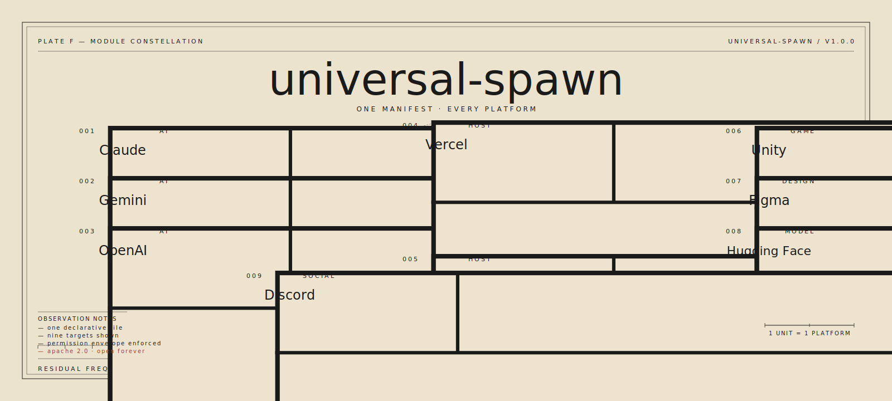

<!--
  universal-spawn — canonical repository
  Residual Frequencies · Parchment palette
  Hero plate: archetype F — Module Constellation
-->

<p align="center">
  
</p>

<p align="center">
  <em>Plate F · Module Constellation · Residual Frequencies</em>
</p>

---

# universal-spawn

**A declarative manifest format for spawning any creation on any
platform.**

`universal-spawn` is an open standard. A single file at the root of your
repository — `spawn.yaml` — makes your creation discoverable,
validatable, and one-click spawnable across AI platforms, hosting
providers, creative tools, dev ecosystems, games, social apps, and
hardware.

Think of it as the **OpenAPI of installable creations**.

- Declarative only — a manifest never contains executable code.
- Strictly validatable — every spec version ships a JSON Schema.
- Universal first — the core manifest works anywhere.
- Platform extensions unlock platform-native perks.
- Safety is a declaration, not a promise: `min_permissions`,
  `rate_limit_qps`, `cost_limit_usd_daily`, `safe_for_auto_spawn`,
  `env_vars_required` — the author publishes the envelope, the platform
  enforces it.

This repository is the **canonical source**:
[`github.com/AgentMindCloud/universal-spawn`](https://github.com/AgentMindCloud/universal-spawn).
Maintained by Jani Solo ([`@JanSol0s`](https://github.com/JanSol0s)) under
the AgentMindCloud organization. Licensed Apache 2.0 in perpetuity.

---

## The minimal manifest

```yaml
spawn_version: "1.0.0"
id: com.example.hello
name: Hello
kind: cli-tool
description: >
  A small reference command-line tool that prints a greeting and exits
  zero. Used as the canonical minimal example for the universal-spawn
  specification.
license: Apache-2.0
author:
  name: Jane Doe
  handle: janedoe
source:
  type: git
  url: https://github.com/janedoe/hello
entrypoints:
  - id: cli
    kind: cli
    ref: bin/hello
min_permissions: []
```

That file, at the root of a repo, is enough to make the project
discoverable, validatable, and spawnable on any conformant platform.
More fields unlock more behavior; see
[`spec/v1.0.0/fields.md`](spec/v1.0.0/fields.md).

---

## How it works

```
                   ┌────────────────────────────────┐
                   │        spawn.yaml (root)       │
                   │  one declarative manifest      │
                   └─────────────────┬──────────────┘
                                     │
       validated by manifest.schema.json (draft 2020-12)
                                     │
       ┌───────────┬─────────┬───────┼───────┬──────────┬──────────┐
       ▼           ▼         ▼       ▼       ▼          ▼          ▼
    claude      gemini    openai  vercel  netlify     unity      figma
    (and discord, huggingface, grok-install, …)
```

The core manifest is universal. Each platform reads the fields that
apply to it; platform-specific extensions live under
`platforms.<platform-id>` and are validated by that platform's
[`schema.extension.json`](platforms/).

---

## Why this exists

Every platform has invented its own installable-creation format. The
same AI skill gets packaged four times for four stores. The same game
mod gets re-described for three engines. The same deployable web app
gets a separate manifest per host. None of them interoperate.

We have a standard for describing HTTP APIs (OpenAPI). We have a
standard for describing containers (OCI). We have a standard for
describing JavaScript dependencies (`package.json`). We do not have a
standard for describing **a spawnable creation**.

That is what this file is.

---

## Principles

1. **Declarative only.** Manifests describe *what*, never *how*.
2. **Strict validation.** If the JSON Schema rejects it, platforms
   reject it.
3. **Universal first, platform second.** Platform perks unlock through
   extensions, not through replacing the core.
4. **Safety through declaration.** Authors publish the permission, rate,
   and cost envelope. Platforms enforce it.
5. **Never hardcode secrets.** Env vars are declared by name.
6. **Backwards compat is a feature.** Round-tripping with
   [`AgentMindCloud/grok-install`](https://github.com/AgentMindCloud/grok-install)
   v2.14 is first-class.
7. **Apache 2.0 forever.** No field of the spec may land under another
   license.

---

## Repository layout

```
spec/
  v1.0.0/
    spec.md                   ← normative prose
    manifest.schema.json      ← normative JSON Schema
    fields.md                 ← field reference
    compatibility-matrix.md   ← per-platform field coverage
examples/                     ← complete example manifests
platforms/                    ← one folder per supported platform
  claude/
  gemini/
  openai/
  vercel/
  netlify/
  unity/
  figma/
  discord/
  huggingface/
docs/                         ← narrative docs (quickstart, safety, …)
design/                       ← design system (Residual Frequencies)
```

---

## Quickstart

1. Copy [`examples/minimal.spawn.yaml`](examples/minimal.spawn.yaml) to
   `spawn.yaml` at the root of your repo.
2. Fill in `id`, `name`, `kind`, `description`, `license`, `author`,
   `source`.
3. Declare `entrypoints` for the surfaces you expose.
4. Declare `min_permissions`, `env_vars_required`, and any cost or rate
   ceilings.
5. Add platform extensions under `platforms.<id>` as needed.
6. Validate:

   ```bash
   npx ajv-cli validate \
     -s https://universal-spawn.org/spec/v1.0.0/manifest.schema.json \
     -d spawn.yaml --spec=draft2020
   ```

Full walkthrough in [`docs/quickstart.md`](docs/quickstart.md).

---

## Supported platforms

| Platform      | Folder                                          | Status       |
|---------------|-------------------------------------------------|--------------|
| Claude        | [`platforms/claude`](platforms/claude)           | v1.0.0 ready |
| Gemini        | [`platforms/gemini`](platforms/gemini)           | v1.0.0 ready |
| OpenAI        | [`platforms/openai`](platforms/openai)           | v1.0.0 ready |
| Vercel        | [`platforms/vercel`](platforms/vercel)           | v1.0.0 ready |
| Netlify       | [`platforms/netlify`](platforms/netlify)         | v1.0.0 ready |
| Unity         | [`platforms/unity`](platforms/unity)             | v1.0.0 ready |
| Figma         | [`platforms/figma`](platforms/figma)             | v1.0.0 ready |
| Discord       | [`platforms/discord`](platforms/discord)         | v1.0.0 ready |
| Hugging Face  | [`platforms/huggingface`](platforms/huggingface) | v1.0.0 ready |

Adding a platform is an ordinary pull request; see
[`CONTRIBUTING.md`](CONTRIBUTING.md#adding-a-platform).

---

## Relationship to `grok-install`

`universal-spawn` is the **universal sibling** to
[`AgentMindCloud/grok-install`](https://github.com/AgentMindCloud/grok-install)
(current v2.14). grok-install is the Grok-specific form; universal-spawn
is the cross-platform superset. A universal-spawn manifest can be
lowered into a grok-install manifest mechanically, and a grok-install
manifest can be lifted back into a universal-spawn manifest without
information loss when the `compat.grok_install` field is set. See
[`docs/grok-compat.md`](docs/grok-compat.md).

---

## Contributing

Read [`CONTRIBUTING.md`](CONTRIBUTING.md). The short version:

- Open an issue before writing code, especially for spec changes.
- The canonical source is this repository. Mirrors are fine; forks that
  re-brand the standard are not.
- Every PR that touches the spec updates the schema, the prose, the
  compatibility matrix, and at least one example.

---

## License

Apache License 2.0. See [`LICENSE`](LICENSE). The specification itself
(everything under `spec/`) is also dedicated to the public under the
same license — you may implement it without permission.
